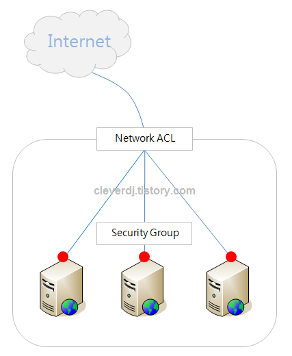

# What is VPC

> Amazon Virtual Private Cloud(VPC)를 사용하면 AWS 클라우드에서 논리적으로 격리된 공간을 프로비저닝하여 고객이 정의하는 가상 네트워크에서 AWS 리소스를 시작할 수 있습니다. IP 주소 범위 선택, 서브넷 생성, 라우팅 테이블 및 네트워크 게이트웨이 구성 등 가상 네트워킹 환경을 완벽하게 제어할 수 있습니다. VPC에서 IPv4와 IPv6를 모두 사용하여 리소스와 애플리케이션에 안전하고 쉽게 액세스할 수 있습니다.

## 중요 키워드

- `논리적으로 격리딘 공간을 프로비저닝`

## 특이사항

- 모든 사용자에게 강제적으로 적용
  - 기존에는 EC2-Classic network
    - EC2-Classic 사용을 통해 다른 고객과 공유하는 단일 일반 네트워크에서 인스턴스가 실행됩니다.
    - 현재는 사용 불가
  - EC2,RDS... 사용시 필수적으로 선택하도록 함

## 용어 설명

### CIDR

> CIDR 블록은 IP의 범위를 지정하는 방식입니다. CIDR 블록은 IP 주소와 슬래시(/) 뒤에 따라오는 넷마스크 숫자로 구성되어있습니다. 이 숫자는 IP 범위를 나타냅니다. 이 숫자가 32이면 앞에 기술된 IP 정확히 하나를 가리킵니다. 예를 들어 192.168.0.0/32는 192.168.0.0을 가리킵니다. 범위는 지정된 IP부터 2^(32-n)개가 됩니다. 예를 들어 뒤의 숫자가 24라면, 2^(32-24)=256개의 IP 주소를 의미합니다. 예를 들어 192.168.0.0/24는 192.168.0.0에서 192.168.1.255까지의 IP를 의미합니다.

### DSCP

> 동적 호스트 구성 프로토콜(Dynamic Host Configuration Protocol, DHCP)은 호스트 IP 구성 관리를 단순화하는 IP 표준이다. 동적 호스트 구성 프로토콜 표준에서는 DHCP 서버를 사용하여 IP 주소 및 관련된 기타 구성 세부 정보를 네트워크의 DHCP 사용 클라이언트에게 동적으로 할당하는 방법을 제공한다.

## 구성 요소

- VPC
- Subnet
- Route Table
- Internet GateWay
- DHCP options set
- Network ACL
- Security Group

## VPC

- private cloud를 만드는데 기본이 되는 리소스
- 논리적인 독립 네트워크
- 이름과 IPv4 CIDR 블록이 필수
- 지정된 CIDR 내에서 적절한 IP를 할당받게 됩니다.
- VPC 의 최대 크기는 16
  - 2^(32-16)=65536개의 IP를 사용가능
- 한번 지정된 CIDR은 변경 불가능
  - 추가는 가능
- 같은 CIDR로 여러개의 VPC 사용가능
  - 다만 너무 많은 VPC 가 겹칠 경우 IP가 겹쳐서 문제가 발생할 수 있음
- 내부의 CIDR 규칙과 외부의 IP 연결은 사용이 불가
  - ex. 52.12.0.0/16 의 VPC 에서 외부 IP 52.12.0.0/16 를 사용 불가
- 기본 VPC 의 CIDR 블록은 172.31.0.0/16

## Subnet

- Subnet은 물리적인 공간인 AZ과 연결 (1:1)
- VPC는 논리적 범위, Subnet 은 물리적으로 리소스가 생성될 수 있는 네트워크
- 서브넷의 최대 크기는 VPC의 크기와 같음
- 하나의 VPC는 N개의 서브넷을 가질 수 있음
- 서브넷을 만들지 않을 수도 있지만, 이 경우 VPC로 아무것도 할 수 없음
- 서브넷의 넷마스크 범위는 16(65535개)에서 28(16개)을 사용할 수 있으며, VPC CIDR 블럭 범위에 속하는 CIDR 블럭을 지정할 수 있음.
- 리전에 따라서 사용가능한 가용존의 갯수는 다름

## Route Table

- 서브넷에서 네트워크를 이용할 때는 이 라우트 테이블을 사용해서 목적지를 찾게 됩니다
- VPC생성시 VPC 에 연결 (Subnet 과 연결 X)
- 라우트 테이블은 VPC에 속한 다수의 서브넷에서 사용할 수 있습니다.
- 기본 Route Table 은 VPC의 CIDR 블럭을 목적지로 하는 경우 타깃이 local인 규칙만 정의 되어 있습니다.
  - ex. VPC의 CIDR 블럭이 172.31.0.0/16일 때 이 네트워크 안에서 목적지가 172.31.0.0/16 범위에 있는 리소스를 찾는다면 VPC 내부에서 찾습니다
  - 이 규칙은 삭제할 수 없습니다
- 인터넷을 연결하거나 다른 VPC와 통신하기 위해서는 라우트 테이블에 라우트 규칙을 추가적으로 정의해야만 합니다

## Internet GateWay

- VPC에서 생성된 리소스들은 기본적으로 인터넷을 사용할 수가 없습니다
- 라우팅 테이블에 인터넷 게이트웨이를 향하는 적절한 규칙을 추가해주면 특정 서브넷이 인터넷과 연결됩니다
- 서브넷과 인터넷 게이트웨이를 연결하는 것만으로는 인터넷을 사용할 수 없습니다. 인터넷을 사용하고자 하는 리소스는 퍼블릭 IP를 가지고 있어야합니다

## DHCP options set

- TCP/IP 네트워크 상의 호스트로 설정 정보를 전달하는 DHCP 표준입니다.
- 도메인 네임 서버, 도메인 네임, NTP 서버, NetBIOS 서버 등의 정보를 설정할 수 있습니다.

## Network ACL

- outbound, inbound 트래픽을 제어하는 가상 방화벽입니다.
- Network ACL : Subnet = 1 : N
- 서브넷 앞단에서 트래픽을 제어하는 역할

## Security Group

- 인스턴스의 앞단에서 트래픽을 제어하는 가상 방화벽

# VPC Peering

- 프라이빗 IPv4 주소 또는 IPv6 주소를 사용하여 두 VPC 간에 트래픽을 라우팅할 수 있도록 하기 위한 두 VPC 사이의 네트워킹 연결
- AWS는 VPC의 기존 인프라를 사용하여 VPC 피어링 연결을 생성
  - 물리적 하드웨어 각각에 의존하지 않습니다
  - 통신 또는 대역폭 병목에 대한 단일 지점 장애가 없습니다
- VPC 피어링 연결의 어느 한 쪽에 위치하는 인스턴스가 퍼블릭 DNS 호스트 이름을 사용하여 상대방을 참조하는 경우 호스트 이름은 인스턴스의 퍼블릭 IP 주소로 확인
  - 이 동작을 변경하려면 VPC 연결에 대해 DNS 호스트 이름 확인을 활성화
  - 활성화 후, 퍼블릭 DNS 호스트 이름을 사용하여 상대방을 참조하는 경우 호스트 이름은 인스턴스의 프라이빗 IP 주소로 확인

## How to Make VPC Peering

1. 요청자 VPC의 소유자가 수락자 VPC의 소유자에게 VPC 피어링 연결을 생성하도록 요청
   - 요청자 VPC의 CIDR 블록과 중첩되는 CIDR 블록은 사용할 수 없음
1. 수락자 VPC의 소유자가 VPC 피어링 연결 요청을 수락하여 VPC 피어링 연결을 활성화
1. 각 VPC의 소유자가 다른 VPC의 IP 주소 범위를 가리키는 경로를 하나 이상의 VPC 라우팅 테이블에 수동으로 추가
1. Security Group을 업데이트

## VPC Peering Life Cycle

- Initiating-request
  - VPC 피어링 연결 요청이 시작되었습니다. 이 단계에서는 피어링 연결이 실패하거나 pending-acceptance로 이동할 수 있습니다.
- Failed
  - VPC 피어링 연결 요청이 실패
  - VPC 피어링 연결 요청을 수락, 거부하거나 삭제할 수 없음
  - 실패한 VPC 피어링 연결은 2시간 동안 요청자에게 보이는 상태
- Pending-acceptance
  - VPC 피어링 연결 요청이 수락자 VPC 소유자의 수락을 기다리고 있는 상태
  - 아무런 조치도 취하지 않으면 요청이 7일 후에 만료
  - 요청자가 요청 삭제 가능
- Expired
  - VPC 피어링 연결 요청이 만료
  - 양쪽 host 모두 어떤 요청도 X
  - 2일 동안 노출
- Rejected
  - 수락자 VPC의 소유자가 거부
  - 거부된 VPC 피어링 연결은 2일 동안 요청자 VPC의 소유자에게 표시되고, 수락자 VPC의 소유자에게는 2시간 동안 표시
  - 같은 AWS 계정 내라면 2시간동안 노출
- Provisioning
  - VPC 피어링 연결 요청이 수락
  - 곧 active
- Active
  - VPC 피어링 연결이 활성화
  - VPC 사이에서 트래픽이 전달
  - VPC 피어링 연결을 삭제 가능, 거부 불가능
- Deleting
  - active 상태인 VPC 피어링 연결 삭제 요청을 제출
  - pending-acceptance 상태인 VPC 피어링 연결 요청을 삭제하는 요청
- Deleted
  - active VPC 피어링 연결을 삭제
  - pending-acceptance VPC 피어링 연결 요청을 삭제
  - VPC 피어링 연결은 2일 동안 요청자 VPC의 소유자에게 표시되고, 수락자 VPC의 소유자에게는 2시간 동안 표시
  - 같은 AWS 계정 내라면 2시간동안 노출

## Multiple Peering

- VPC 피어링 연결은 두 VPC 간에 일대일 관계
  
- 전이성 피어링 관계는 지원되지 않음

## Reference

- [44bits](https://www.44bits.io/ko/post/understanding_aws_vpc)
- [AWS Document](https://docs.aws.amazon.com/ko_kr/vpc/latest/peering/what-is-vpc-peering.html)
- [할롬님의 블로그](https://cleverdj.tistory.com/122)
- [동적 호스트 구성 프로토콜](https://ko.wikipedia.org/wiki/%EB%8F%99%EC%A0%81_%ED%98%B8%EC%8A%A4%ED%8A%B8_%EA%B5%AC%EC%84%B1_%ED%94%84%EB%A1%9C%ED%86%A0%EC%BD%9C)
